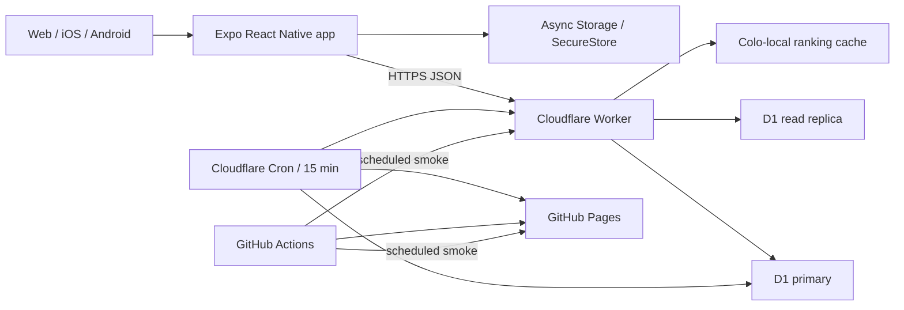

# Architecture

## システム構成

クライアントは単一の `GameState` で画面を切り替える小規模MVPです。ゲーム画面はモードごとに分け、モード共通の表示・設定・ランキング処理は共有コンポーネントと `gameConfig.ts` に集約しています。

## 責務

| 領域 | 主なファイル | 責務 |
| --- | --- | --- |
| 画面遷移・ゲーム制御 | `src/App.tsx`, `src/components/AppScreenRouter.tsx`, `src/App.styles.ts` | 画面状態、ゲーム開始・終了、画面ルーティング、スタイル |
| 起動・復帰・定期同期 | `src/hooks/useAppData.ts` | 設定、名前、ランキング、保留投稿同期、アセット先読込 |
| 共通ゲーム枠 | `src/components/game/GameFrame.tsx` | 終了操作、得点、残り時間、進捗の配色とアクセシビリティ |
| 画面遷移支援 | `src/domain/navigation.ts`, `src/hooks/useHardwareBackNavigation.ts`, `src/hooks/useScreenAnnouncement.ts` | Androidの戻る層級、画面遷移の読み上げ |
| モード定義 | `contracts/rankings.json`, `src/generated/rankingContract.ts`, `src/gameConfig.ts` | API種別、期間、島地域の正本と生成物、表示名、単位、配色、順序 |
| ゲーム規則 | `src/gameRules.ts` | 共通時間、5分上限、回答間隔、減点、回復、特別得点 |
| 島データ | `src/data/islands.ts`, `src/assets/islands/` | 415件の名前、自治体、地域分類、ローカルSVG |
| 純粋ロジック | `src/domain/` | シャッフル、色分類、締切タイマー、名前正規化、期間、順位 |
| UI | `src/components/` | ゲーム、履歴、規約、共通UI |
| 永続化・通信 | `src/services/` | APIクライアント、投稿、読込、保存形式、キャッシュ、排他制御付きオフラインキュー |
| APIルーティング | `worker/src/index.ts`, `worker/src/http.ts` | CORS、応答ヘッダー、エラー境界、経路選択 |
| 公開ランキング | `worker/src/leaderboards.ts` | D1読込、所有者別集計、エッジキャッシュ、失効 |
| 投稿・本人データ | `worker/src/scoreSubmissions.ts`, `worker/src/playerRankings.ts` | セッション、冪等投稿、履歴、削除 |
| 識別・制限 | `worker/src/identity.ts` | Bearer所有者、ハッシュ化、原子的な連投制限 |
| 入力境界 | `worker/src/rankingValidation.ts` | 型、文字、時間、得点成立性の検証 |
| 本番内監視 | `worker/src/productionMonitor.ts` | D1・Web・release metadataの心拍、状態遷移通知 |

## ランキングのデータフロー

1. 初回利用時にExpo Cryptoで端末トークンを作り、iOS/AndroidはSecureStore、Webはローカルストレージへ保存します。
2. オンラインランキングが有効な場合だけ、ゲーム開始前にBearer付きでWorkerから15分有効なゲームセッションを取得し、`App.tsx` が開始時刻とともに保持します。
3. 終了時に名前、整数スコア、モード、島地域、経過時間、投稿ID、ゲームセッションIDをWorkerへ送ります。
4. Workerが所有者・モード・地域・未使用・有効期限・サーバー観測時間、入力、Origin、得点速度を検証します。
5. WorkerはトークンをSHA-256へ一方向変換し、セッション消費とランキング登録を1つのD1 batchで確定します。
6. 投稿IDをD1の主キーに使い、同一内容の通信再試行を冪等にします。ゲームセッションは1投稿にしか使えません。
7. 開始後の通信失敗は同じIDで端末へ最大50件保存し、有効期限内に起動・アプリ復帰・Webオンライン復帰時と表示中30秒ごとに最大3件ずつ同期します。期限と間隔は `contracts/rankings.json` からアプリとWorkerへ生成します。未送信データへ秘密トークンは保存せず、送信時に保護領域から読みます。オンラインランキングをオフにすると同期を停止し、保存待ちキューを削除します。セッションなし・期限切れは端末履歴だけに残します。
8. 投稿成功直後は同じBearerとブラウザの `no-store` 指定で公開順位を再取得し、ブラウザ・エッジキャッシュを迂回してprimaryから確定済みスコアを読みます。ランキング応答は `Vary: Authorization` で匿名取得と認証付き取得を分離します。
9. WorkerはBearer所有者の最高記録IDをprimaryで照合し、本人向け応答にだけ `isCurrentPlayer` を付けます。公開エッジスナップショットへ本人情報を保存しません。
10. 表示時は所有者ハッシュ単位で重複排除し、最高点、先着順で並べます。所有者情報のない移行前記録だけは正規化名を単位にします。端末fallbackでも同名の別所有者を保持し、本人マーカー付き記録だけを自己最高点へまとめます。

公開ランキングは既定の30件だけをCloudflareの実行拠点単位で30秒間fresh、最大5分間の障害時スナップショットとして保持します。同じキーの同時cache missは1回のD1要求へまとめ、投稿時は対象スコープの4期間、本人削除時は旧九州を含む52キーを失効させます。別拠点のキャッシュは通常最大30秒遅れ、D1障害中にstale snapshotが使われる場合は削除・更新の反映が最大5分遅れる可能性があります。

通常の公開読込はD1 Sessions APIの `first-unconstrained` で最寄りの利用可能なレプリカを許可します。投稿成功直後のBearer付き公開読込、本人マーカー照合、本人履歴・自己ベストは `first-primary`、投稿と削除はprimaryへ送ります。所有者あり・移行前データを別CTEへ分け、公開集計用2索引と本人照合用部分インデックスを利用します。

起動時は `useAppData.ts` が最初に設定を読み、ランキング取得、名前読込、設定に従った保留スコア同期を `Promise.allSettled` で並列実行します。ランキングはモード単位で部分成功させ、キャッシュ表示と失敗を画面で区別します。設定更新、ランキングキャッシュのread-modify-write、保留キューの読込・同期・追加・削除は保存領域ごとの非同期mutexで直列化し、同時操作で更新が失われないようにします。

## API契約

| Method | Path | 用途 |
| --- | --- | --- |
| GET | `/health` | WorkerとD1の生存確認 |
| POST | `/game-sessions` | 使い切りランキング用ゲームセッション発行 |
| GET | `/rankings` | モード・島地域・期間別上位一覧 |
| POST | `/scores` | 冪等なスコア登録 |
| GET | `/players/me/best` | Bearer所有者のモード別自己ベスト |
| GET | `/players/me/history` | Bearer所有者のモード別非公開履歴 |
| DELETE | `/players/me/scores` | Bearer所有者の全スコア削除 |

ランキング期間は `all`, `daily`, `weekly`, `monthly` で、日・週・月の境界はJSTです。週は月曜日開始です。

API v5のゲーム種別、期間、島地域、地域キーは `contracts/rankings.json` を唯一の正本とし、アプリ、Worker、運用スクリプト用TypeScript/JavaScriptを生成します。CIは生成差分、DBの地域制約、公開スコープの一致を拒否します。

## 業務ルール

- 共通: 30秒、2択、正解1点、不正解3秒減少。
- いちご: 2連続目から0.5秒回復。ショートケーキ3点+2秒、ホールケーキ5点+5秒、終了後に記憶チャレンジ。
- 島: 415件を日本全国または北海道・東北、関東、中部・近畿、中国、四国、九州北部、九州南部、沖縄から出題。九州北部は福岡・佐賀・長崎の90島、九州南部は熊本・大分・宮崎・鹿児島の59島。通常正解で0.3秒回復。ゴールデン島は3点になり、さらに1秒回復。
- 国旗・色: 正解ごとに1秒回復。
- 国旗: Unicode国旗を端末内で生成し、外部CDNへ依存しません。
- サーバー: モードごとの最大点と経過時間から、成立不能な投稿を拒否します。
- セッション: 時間回復を含め最長5分。100ms刻みの減算ではなく絶対締切から残り時間を再計算します。

クライアントは改変可能なので、サーバー検証は不正を完全に防ぐ仕組みではなく、明らかな異常と大量投稿を抑える境界です。

## 保存データ

| 保存先 | データ | 保持 |
| --- | --- | --- |
| D1 `rankings` | 投稿ID、公開名、スコア、モード、島地域、日時、所有者ハッシュ | 運営中または本人削除まで |
| D1 `score_submission_buckets` | ソルト付き接続元ハッシュ、分単位窓、回数 | 15分以内 |
| D1 `game_sessions` | 所有者ハッシュ、モード、地域、開始・失効・消費情報 | 失効後、15分ごとのcronまで |
| D1 `service_heartbeats` | 監視状態、確認日時、レイテンシ、内部診断 | 最新の1状態を上書き |
| Async Storage | 名前、テーマ・振動・オンラインランキング設定、ランキングキャッシュ、端末履歴、資格情報を含まない保留投稿 | 本人がアプリ内または端末設定で削除するまで |
| SecureStore | iOS/Androidの端末トークン | 本人がアプリ内または端末設定で削除するまで |

スキーマは `worker/schema.sql`、変更は `worker/migrations/` で管理します。

## 設計上の制約

- アカウント認証はなく、端末トークンは公開順位、履歴、削除の匿名所有者を証明します。同名の別所有者は別順位で、所有者情報のない移行前記録だけは同一名として扱います。
- Pagesは静的配信で、API障害時もゲーム本体は動作します。
- D1障害時は5分以内のランキングスナップショットを返せますが、新規投稿と本人データ操作はD1復旧まで成功しません。
- GitHub Actionsの外形監視に加え、Cloudflare Cronが15分ごとにD1とPagesを別経路から検査します。公開 `/health` は診断詳細を除いた最新心拍だけを返し、GitHub監視が25分以上の停止を検出します。
- D1とWorkerはCloudflare単一ベンダーに依存します。静的ゲームと端末履歴は独立していますが、ランキングの複数ベンダー書込フェイルオーバーはMVP範囲外です。
- 小規模MVPのためルーターやグローバル状態管理ライブラリは導入していません。
- 島ランキングは日本全国と8地域を別スコープとして集計します。九州分割前の149島ランキングは新2部門へ混ぜず `kyushu` のまま保全し、履歴では「旧九州」と表示します。初回地域分割前の島ランキングは運用判断により関東へ再分類しています。
- 賞品、課金、強い本人性が必要になった場合は、匿名トークンではなくアカウントとサーバー権威のゲーム進行へ再設計します。
