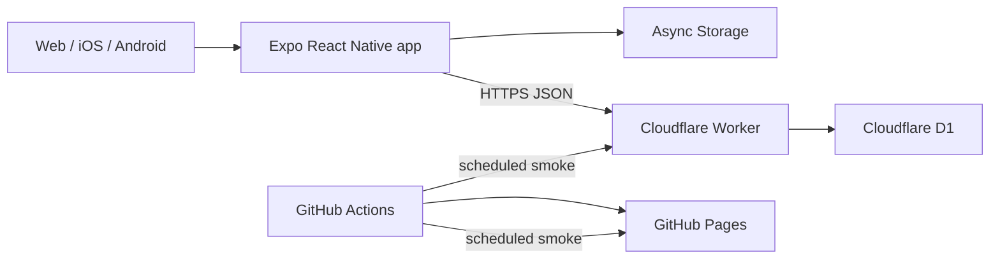

# Architecture

## システム構成

クライアントは単一の `GameState` で画面を切り替える小規模MVPです。ゲーム画面はモードごとに分け、モード共通の表示・設定・ランキング処理は共有コンポーネントと `gameConfig.ts` に集約しています。

## 責務

| 領域 | 主なファイル | 責務 |
| --- | --- | --- |
| 画面遷移・起動処理 | `src/App.tsx` | 設定、名前、ランキング、同期、ゲーム状態 |
| モード定義 | `src/gameConfig.ts` | API種別、表示名、単位、配色、順序 |
| ゲーム規則 | `src/gameRules.ts` | 共通時間、減点、回復、特別得点 |
| 純粋ロジック | `src/domain/` | シャッフル、進捗、名前正規化、期間、順位 |
| UI | `src/components/` | ゲーム、履歴、規約、共通UI |
| 永続化・通信 | `src/services/` | Async Storage、タイムアウト、再試行、オフラインキュー |
| API | `worker/src/index.ts` | CORS、ルーティング、レート制限、D1アクセス |
| 入力境界 | `worker/src/rankingValidation.ts` | 型、文字、時間、得点成立性の検証 |

## ランキングのデータフロー

1. ゲーム開始時刻を `App.tsx` が保持します。
2. 終了時に名前、整数スコア、モード、経過時間、ランダムな投稿IDをWorkerへ送ります。
3. Workerが入力、Origin、連投、成立可能な得点速度を検証します。
4. 投稿IDをD1の主キーに使い、通信再試行による二重登録を防ぎます。
5. 失敗時は同じ投稿IDのまま端末へ最大50件保存します。次回起動時は最大3件ずつ同期し、通信障害を1件検出した時点で停止します。
6. 表示時はプレイヤー名を空白・大文字小文字を無視した単位で重複排除し、最高点、先着順で並べます。

起動時のランキング取得、設定読込、名前読込、保留スコア同期は並列です。同期成功時だけランキングを再取得します。

## API契約

| Method | Path | 用途 |
| --- | --- | --- |
| GET | `/health` | WorkerとD1の生存確認 |
| GET | `/rankings` | モード・期間別上位一覧 |
| POST | `/scores` | 冪等なスコア登録 |
| GET | `/players/:name/best` | モード別自己ベスト |
| GET | `/players/:name/history` | モード別履歴 |

ランキング期間は `all`, `daily`, `weekly`, `monthly` で、日・週・月の境界はJSTです。週は月曜日開始です。

## 業務ルール

- 共通: 30秒、2択、正解1点、不正解3秒減少。
- いちご: 2連続目から0.5秒回復。ショートケーキ3点+2秒、ホールケーキ5点+5秒、終了後に記憶チャレンジ。
- 島: 通常正解で0.3秒回復。ゴールデン島は3点になり、さらに1秒回復。
- 国旗・色: 正解ごとに1秒回復。
- 国旗: Unicode国旗を端末内で生成し、外部CDNへ依存しません。
- サーバー: モードごとの最大点と経過時間から、成立不能な投稿を拒否します。

クライアントは改変可能なので、サーバー検証は不正を完全に防ぐ仕組みではなく、明らかな異常と大量投稿を抑える境界です。

## 保存データ

| 保存先 | データ | 保持 |
| --- | --- | --- |
| D1 `rankings` | 投稿ID、公開名、スコア、モード、日時 | 運営中 |
| D1 `score_submission_events` | ソルト付き接続元ハッシュ、日時 | 15分以内 |
| Async Storage | 名前、設定、ランキングキャッシュ、保留投稿 | 利用者がアプリデータを消すまで |

スキーマは `worker/schema.sql`、変更は `worker/migrations/` で管理します。

## 設計上の制約

- ユーザー認証はなく、同名プレイヤーはランキング上で同一名として扱います。
- Pagesは静的配信で、API障害時もゲーム本体は動作します。
- 小規模MVPのためルーターやグローバル状態管理ライブラリは導入していません。
- 10点に向けた将来課題は、実機E2E、実利用に基づく難易度調整、認証が必要になった場合の本人性設計です。
